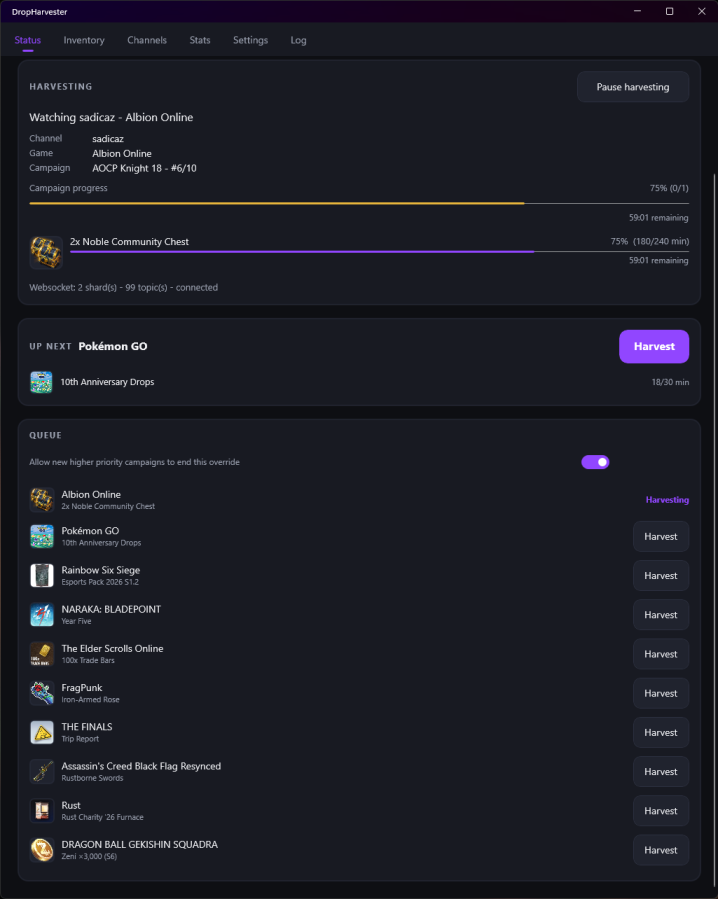
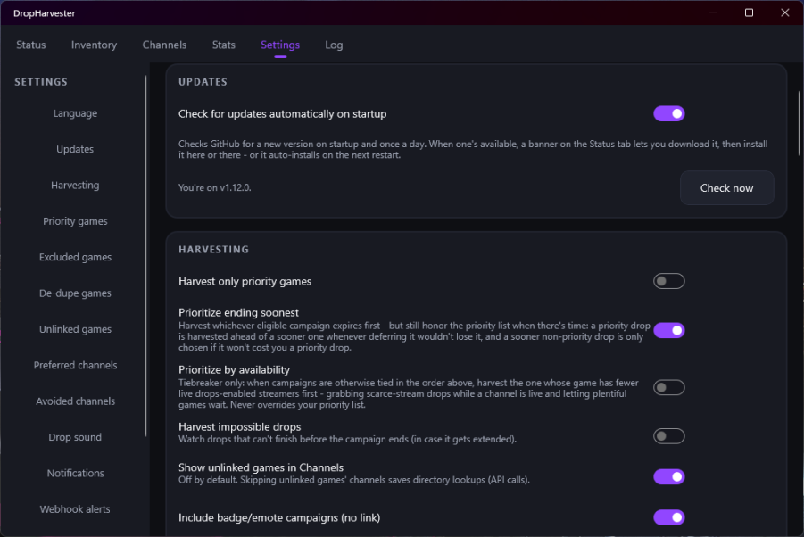

# DropHarvester

A native **.NET 10 MAUI** desktop app for **Windows and macOS** that harvests Twitch
drops **without downloading the stream** - it emulates "watching" by sending a
minute-watched heartbeat, so it earns drops on near-zero bandwidth. Modern UI with
a number of extra features.

## Screenshots

| Status | Settings |
| :---: | :---: |
|  |  |

## Features

### Core harvesting

- **Stream-less drop harvesting** - no video download; a ~59s minute-watched heartbeat.
- **Automatic watch-method failover** - if Twitch stops crediting one watch method, it tries the backups and stays on whichever works, so a Twitch-side change costs minutes, not days.
- **Automatic campaign discovery** from your linked accounts.
- **Drops-enabled validation** - only harvests channels that can actually earn the drop.
- **Auto-claim** the instant a drop completes, with a safety net that re-scans and retries so nothing is left unclaimed through a missed event, outage, or restart.
- **Auto start/stop** as campaigns appear and finish.
- **Sharded PubSub websockets** - track many channels for real-time online/offline and drop events.
- **Channel-points auto-claim** on the watched channel (optional).
- **Persistent login** - device-code OAuth; the token is saved and reused.

### What to harvest, and in what order

- **Game priority & exclusion lists** - harvest what you want, in the order you want.
- **Prioritize ending soonest** - harvest by soonest expiry while still honoring your priority list wherever deferring a drop wouldn't lose it.
- **Prioritize by availability** (opt-in) - a tiebreaker that grabs scarce-stream drops first when campaigns are otherwise tied. Never overrides your priority list.
- **Priority-only mode** - ignore everything not on the priority list.
- **Harvest unlinked games** (opt-in per game) - attempt games your account isn't linked to, always at lowest priority.
- **Per-game de-duplication** - skip any drop whose reward you already own.

### Channels

- **Automatic channel switching** - reacts the instant the watched stream goes down and immediately re-scans for the next target. If a manual override's only stream goes offline, it harvests the next-best campaign meanwhile and snaps back when the override is live again.
- **Official Campaign Channel handling** - channel-specific drops are watched on their official channel first; generic drops keep progressing on any channel.
- **Prefer / Avoid channels** - right-click a channel to ⭐ Prefer it (idle on it when it's live for the game being harvested) or 🚫 Avoid it (only used if it's the last drops-enabled stream live). Both lists are also editable under Settings.
- **Collapsible per-game groups** - the Channels tab groups streams by game with live counts, refreshing in the background about every 5 minutes.
- **"Not crediting" fast-switch** - if a drop makes no progress on an open-campaign channel for a few minutes, it's benched and another is tried (official channels are never fast-switched).

### Inventory & status

- **Live inventory** - the Campaigns tab shows every campaign and drop with live progress, and a purple **Harvesting** badge on the one being harvested now.
- **Subscription drops** - drops that need a channel sub are auto-detected and get a purple **SUB** badge; DropHarvester verifies whether you already qualify and skips the ones you don't, and drops earned by subscribing alone show a **Buy Drop** link. Sub-only campaigns sit under an opt-in **Sub-Only** filter.
- **Claim-based campaign tabs** - each campaign sits in one tab: **Finished** (every reward claimed), **Expired** (past its end date), or **Upcoming** (anything still earnable). Claim attribution handles reward ids reused across concurrent campaigns so a still-earnable campaign is never wrongly marked done.
- **Language** - a Settings dropdown switches the UI language live: English, Español, Français, Deutsch, Русский, 简体中文, 日本語, 한국어, Nederlands. Diagnostic logs stay English.

### Alerts & feedback

- **Desktop notifications** - drop claimed, campaign complete, all drops harvested, login expired (each names the drop or campaign).
- **Drop-claimed sound** - choose any sound file, output device, and volume, with a Test button.
- **Remote webhook alerts** - Discord / Slack / generic webhook, with per-event toggles.
- **Connection watchdog** - a banner if Twitch Drops go down or the connection drops for a sustained stretch; harvesting resumes automatically when it's back.

### Stats, log & app

- **Stats & history dashboard** - lifetime totals, a 7-day claims chart, recent history, and CSV/JSON export.
- **Log tab** - the running output with a **Copy** button and auto-scroll.
- **Debug server** - an optional local HTTP endpoint exposing what the app is doing. See [Debug server](#debug-server) below.
- **Tray / menu-bar** - on Windows, closing the window hides it to the system tray and keeps harvesting (right-click for Open / Quit); on macOS a menu-bar item gives a status line, Open, and Quit.
- **Resilience** - all Twitch calls retry transient failures with backoff, and claim/sync/points errors are logged and retried rather than killing the loop.
- **In-app updates** - new versions download and install themselves in the background, with an **Update now** button on the Status tab if you'd rather not wait.
- **Autostart** with the OS (Windows Run key / macOS LaunchAgent), optionally into the tray.

## Debug server

A small **localhost-only** HTTP endpoint for inspecting exactly what the app is doing, so you can answer "why is *this* being harvested / skipped / shown as claimed?".

**Enable it:** Settings -> **DEBUG SERVER** -> toggle **Run local debug server**
(default port **5757**, editable). It starts immediately and again on app launch
while the toggle is on. It binds to `127.0.0.1` only (no external access) and uses
a raw socket, so it needs no admin rights or firewall changes.

Open **`http://localhost:5757/`** in a browser. Endpoints:

- **`/`** - index with links to the endpoints below.
- **`/snapshot`** - the main one: a JSON snapshot of live state and every decision.
- **`/claims-raw`** - the raw claimed-drop history from Twitch (JSON).
- **`/watch-probe`** - send a minute-watched heartbeat on every watch method now and dump each request/response, so you can see which methods Twitch is accepting.
- **`/authstate`** - the current auth/session context, secrets redacted (JSON).
- **`/harvest`** - list harvestable targets; `?id=<id>` pins one, `?clear=1` releases (JSON).
- **`/log`** - the rolling log as plain text (up to 2000 recent lines).
- **`/crashlog`** - the app's `crash.log` (unhandled plus caught UI-dispatch errors).

### What `/snapshot` contains

Top level:

- `GeneratedUtc`, `IsRunning`
- `Summary` - the current status line, including the reason when idle (e.g. "waiting
  for a stream to come online") so you can tell *why* nothing is being harvested
- `Active` - the channel / game / campaign / drop being watched right now
- `WatchTransport` / `WatchSelfHeal` - the watch method in use right now and the failover
  state (whether it's mid-rotation, exhausted, or an outage is flagged)
- `Override` - the manual "Harvest" override state: whether one is `Active`, its
  `CampaignId` / `Campaign` name, and whether it's `DropOnly`
- `LastClaimSweepUtc` - when the all-campaign claim safety-net last ran
- `Settings` - the harvesting-relevant settings (ending-soonest, availability-priority,
  priority-only, impossible drops, badges/emotes, and the priority / excluded /
  de-dupe / harvest-unlinked lists)
- `ClaimHistoryCount` and `ClaimHistory` - the full claimed-reward history as
  `RewardId -> AwardedAt` (normalized reward ids, the same keys used for matching)
- `SkippedDrops` - how many drops were given up on this session
- `BenchedChannels` - channels temporarily benched for not crediting, with the
  time each is benched until
- `HarvestableGames` - the harvestable games in harvesting order
- `LiveStreamersByGame` - live drops-enabled streamer count per game from the last
  channel refresh (the input to the availability tiebreaker)

`Campaigns` - the candidate campaigns in harvesting order, each with **why** it is or
isn't being harvested:

- `Id`, `Name`, `Game`, `StartsAt`, `EndsAt`, `Linked`, `AllowedChannels`
- `LiveStreamers` - live drops-enabled streamer count for this campaign's game
- `Eligible` - passes the link/badge eligibility check
- `BlockReason` - `null` if harvestable now, otherwise the human reason it's passed
  over (not linked, already claimed this campaign, reward already owned, no time
  left, given up, etc.)
- `FinishedForHarvesting` - every drop is claimed/complete
- `Drops[]` - each drop with:
  - `Name`, `RequiredMinutes`, `CurrentMinutes`, `IsClaimed`, `IsComplete`
  - `RequiresSubscription`, `RequiredSubs`, `CurrentSubs`, `SubRequirementMet` - the sub
    gate and whether you meet it
  - `ClaimedThisCampaign` - the claim-history verdict for this campaign
  - `GivenUp` - given up on this session (no progress)
  - `Benefits[]` - each reward with `Id`, `MatchKey` (the normalized id used for
    matching), `Name`, `ClaimedAt` (award time from the claim history, or `null`),
    `GrantedByCampaigns` (how many active campaigns grant this reward), and
    `AttributedHere` (whether a claim of this reward is attributed to *this*
    campaign).

### What you can diagnose with it

- **Why a game/drop is being skipped** - read `BlockReason` and the per-drop flags
  for that campaign.
- **Whether a drop is really claimed** - check `IsClaimed` / `IsComplete` (Twitch's
  state) and `ClaimedThisCampaign` / the benefit's `ClaimedAt` + `AttributedHere`
  (the claim-history match). If `ClaimedAt` is `null`, the reward isn't in your
  claim history under that id.
- **Claim-attribution across concurrent campaigns** - `GrantedByCampaigns` and
  `AttributedHere` show when a reward is shared (ambiguous) versus uniquely tied to
  one campaign's window.
- **Channel behavior** - `Active` shows what's being watched; `BenchedChannels`
  shows what's been temporarily avoided for not crediting.
- **What Twitch actually reported** - `ClaimHistory` and each drop's minutes /
  claimed flags are the values read straight from the inventory response.

## Requirements

- .NET 10 SDK with the MAUI workload
  (`maui-windows` on Windows, `maccatalyst` on macOS).
- Windows 10 1809+ or macOS 15+.

## Build & run

The project targets each desktop OS on its native build host, so `dotnet` picks
the right framework automatically.

```bash
# Windows
dotnet build -f net10.0-windows10.0.19041.0 -c Debug
dotnet run   -f net10.0-windows10.0.19041.0

# macOS (requires Xcode)
dotnet build -f net10.0-maccatalyst -c Debug
dotnet run   -f net10.0-maccatalyst
```

## Usage

1. Launch the app and open the **Status** tab.
2. Click **Log in with Twitch** - a browser opens to `twitch.tv/activate`; enter
   the shown code and approve. (You must have linked your game accounts on Twitch
   yourself; the app only discovers campaigns for already-linked accounts.)
3. Harvesting starts automatically. Use **Settings** to set priority/excluded games,
   the de-dupe and harvest-unlinked lists, the drop-claimed sound, notifications,
   webhooks, tray, autostart, and the debug server.
4. Watch progress on **Status** and **Campaigns**; tracked streams on **Channels**
   (right-click to prefer/avoid); totals on **Stats**; and the running output on
   **Log**. Turn on the debug server if you want to inspect decisions in detail.

## Run in Docker (headless)

The same harvesting engine runs as a headless background service - no desktop, no UI -
for people who'd rather run DropHarvester on a server / NAS / Raspberry Pi. It shares
`DropHarvester.Core` with the desktop app; only the front-end differs.

```bash
# Build + start in the background
docker compose up -d --build

# First run only: watch the logs for the Twitch login prompt
docker compose logs -f
#   ==================== TWITCH LOGIN REQUIRED ====================
#     1) On any device, open:  https://www.twitch.tv/activate?device-code=XXXXXXXX
#     2) Enter this code:      XXXXXXXX
# Approve it once; the token is saved to the volume and reused on every restart.

# Live state / liveness
curl http://localhost:8080/status
curl http://localhost:8080/healthz     # -> "ok" (used by the container HEALTHCHECK)
```

Or without compose:

```bash
docker build -t dropharvester-daemon .
docker run -d --name dropharvester \
  -e DH_PRIORITY_GAMES="Rust,Fortnite" \
  -e DH_WEBHOOK_URL="https://discord.com/api/webhooks/..." \
  -v dropharvester-data:/data -p 8080:8080 \
  dropharvester-daemon
docker logs -f dropharvester          # first-run login code
```

Notes:

- **Auth is one-time.** The device-code login only happens on first run (or after the
  token is revoked); the token persists in the `/data` volume. If it ever expires, the
  daemon logs a fresh code and pauses harvesting until you approve it.
- **You still link game accounts on Twitch yourself** - the harvester only discovers
  campaigns for already-linked accounts.
- **Config is env-vars.** See [`.env.example`](.env.example) for the full list
  (`DH_PRIORITY_GAMES`, `DH_EXCLUDE_GAMES`, `DH_WEBHOOK_URL`, `DH_WEBHOOK_EVENTS`,
  `DH_CLAIM_CHANNEL_POINTS`, `DH_PROXY`, `DH_HEALTH_PORT`, `DH_LOG_LEVEL`, ...). Values
  set in the environment win over `settings.json` on the volume.
- **Webhooks come along** (Discord/Slack/generic) - ideal for a background service - but
  tray, desktop notifications, sound and the in-app auto-updater are desktop-only.
  Update a container by pulling/building a newer image.
- **Debug server (opt-in).** Set `DH_DEBUG_SERVER=true` (and map port `5757`) to expose the same
  rich endpoints the desktop app has - `/snapshot` (per-campaign/drop harvesting decisions + claim
  attribution), `/log` (rolling log), `/claims-raw` (raw Twitch claim history). Separate from the
  always-on `/healthz` + `/status`.
- **Multi-arch.** The image builds for `linux/amd64` and `linux/arm64`
  (`docker buildx build --platform linux/amd64,linux/arm64 ...`).
- **Bind mounts:** the container runs as non-root (uid 10001). A named volume (the
  compose default) just works; if you bind-mount a host directory instead, make it
  writable by that uid.

## Architecture

The solution is three projects:

- **`DropHarvester.Core`** - the MAUI-free harvesting engine, domain models and
  persistence, targeting plain `net10.0` so it runs anywhere .NET does (including a
  Linux container). Depends only on `CommunityToolkit.Mvvm`.
- **`DropHarvester`** - the desktop MAUI app (Windows + macOS); references Core and
  adds the UI, tray/notifications/sound, and the installer-based auto-updater.
- **`DropHarvester.Daemon`** - the headless service for Docker; references Core (see
  [Run in Docker](#run-in-docker-headless)).

- **Harvesting engine** (`DropHarvester.Core/Services/Twitch/`) - pure .NET (`HttpClient`,
  `ClientWebSocket`, `System.Text.Json`), identical on both OSes:
  - `TwitchAuthService` - device-code OAuth + token validation/persistence.
  - `GqlClient` - Twitch private GraphQL (persisted queries + the raw watch
    mutation), with bounded retry/backoff on transient failures.
  - `InventoryService` - campaign/drop discovery, progress sync, claiming, and the
    claimed-reward history.
  - `WatchService` - the minute-watched heartbeat, cascading across transports
    (the `track` POST on beacon/spade/trowel hosts, then the `sendSpadeEvents`
    GraphQL mutation) so the orchestrator can self-heal onto whichever Twitch is
    crediting.
  - `WebsocketPool` - sharded PubSub (LISTEN/PING/reconnect).
  - `ChannelManager` - live drops-enabled channel discovery + stream state.
  - `HarvesterOrchestrator` - the run loop tying it together; emits `HarvesterEvent`s and
    exposes the debug snapshot.
- **Core services** (`DropHarvester.Core/Services/`) - `SettingsStore`, `StatsService`,
  `WebhookNotifier`, `DebugServer`, plus the `HarvesterEventBus`. App-only services stay in
  the app: `UpdateService` (installer-based updater) and `AlertsCoordinator` (bridges the
  event bus to notifications/webhooks/stats/tray/sound).
- **Update checker** (`Services/UpdateService.cs`) - checks the GitHub Releases API for
  the latest per-OS installer (on startup and once every 24 hours) and self-installs.
- **UI** - MAUI Shell tabs (Status, Campaigns, Channels, Stats, Settings, Log),
  MVVM via CommunityToolkit.Mvvm, fed by an in-process `HarvesterEventBus`. Observable
  models and collections marshal changes to the UI thread via an injectable
  `IUiDispatcher` - the desktop app backs it with MAUI's main thread; the headless
  daemon runs everything inline.
- **Platform code** (`Platforms/{Windows,MacCatalyst}/`) - tray, notifications,
  autostart, and the drop-claimed sound (NAudio on Windows, AVFoundation on macOS)
  behind shared interfaces, selected in `MauiProgram`.

Persisted files live in the app data folder: `auth.json`, `settings.json`,
`stats.json`.

## Building

```bash
# Windows
dotnet build DropHarvester.csproj -c Release -f net10.0-windows10.0.19041.0

# macOS (Mac Catalyst)
dotnet build DropHarvester.csproj -c Release -f net10.0-maccatalyst
```
